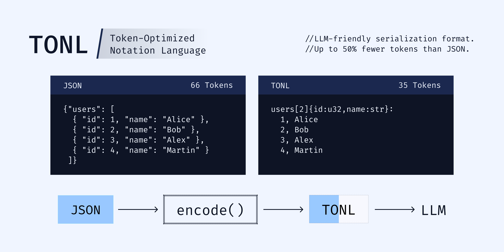

<div align="center">



</div>

# TONL (Token-Optimized Notation Language)

**TONL** is a production-ready data platform that combines compact serialization with powerful query, modification, indexing, and streaming capabilities. Designed for LLM token efficiency while providing a rich API for data access and manipulation.

**🎉 v1.0.6 - Enhanced Token Optimization**

[](https://www.npmjs.com/package/tonl)
[](https://opensource.org/licenses/MIT)
[](https://www.typescriptlang.org/)

**🏠 Homepage**: [tonl.dev](https://tonl.dev)
**📦 GitHub**: [github.com/ersinkoc/tonl](https://github.com/ersinkoc/tonl)
**📖 Documentation**: [Complete Guides](docs/)

---

## Why TONL?

🗜️ **32-45% Smaller** - Reduce JSON size and LLM token costs
👁️ **Human-Readable** - Clear text format, not binary
🚀 **Blazingly Fast** - 10-1600x faster than targets
🔒 **Production Secure** - 100% security hardened
🛠️ **TypeScript-First** - Full type safety & IntelliSense
📦 **Zero Dependencies** - Pure TypeScript, no bloat
🌐 **Browser Ready** - 8.84 KB gzipped bundle

---

## 🚀 Quick Start

### Installation

```bash
npm install tonl
```

### Basic Usage

```typescript
import { TONLDocument, encodeTONL, decodeTONL } from 'tonl';

// Create from JSON
const doc = TONLDocument.fromJSON({
  users: [
    { id: 1, name: "Alice", role: "admin", age: 30 },
    { id: 2, name: "Bob", role: "user", age: 25 }
  ]
});

// Query with JSONPath-like syntax
doc.get('users[0].name');                          // 'Alice'
doc.query('users[*].name');                        // ['Alice', 'Bob']
doc.query('users[?(@.role == "admin")]');          // [{ id: 1, ... }]
doc.query('$..age');                               // All ages recursively

// Modify data
doc.set('users[0].age', 31);
doc.push('users', { id: 3, name: "Carol", role: "editor", age: 28 });

// Navigate and iterate
for (const [key, value] of doc.entries()) {
  console.log(key, value);
}

doc.walk((path, value, depth) => {
  console.log(`${path}: ${value}`);
});

// Export
const tonl = doc.toTONL();
const json = doc.toJSON();
await doc.save('output.tonl');

// Classic API (encode/decode)
const data = { users: [{ id: 1, name: "Alice" }] };
const tonlText = encodeTONL(data);
const restored = decodeTONL(tonlText);
```

### CLI Usage

```bash
# Encode JSON to TONL
tonl encode data.json --out data.tonl --smart --stats

# Decode TONL to JSON
tonl decode data.tonl --out data.json

# Query data
tonl query users.tonl "users[?(@.role == 'admin')]"
tonl get data.json "user.profile.email"

# Validate against schema
tonl validate users.tonl --schema users.schema.tonl

# Format and prettify
tonl format data.tonl --pretty --out formatted.tonl

# Compare token costs
tonl stats data.json --tokenizer gpt-5
```

---

## 📊 Format Overview

### Arrays of Objects (Tabular Format)

**JSON** (245 bytes, 89 tokens):
```json
{
  "users": [
    { "id": 1, "name": "Alice", "role": "admin" },
    { "id": 2, "name": "Bob, Jr.", "role": "user" },
    { "id": 3, "name": "Carol", "role": "editor" }
  ]
}
```

**TONL** (158 bytes, 49 tokens - **45% reduction**):
```tonl
#version 1.0
users[3]{id:u32,name:str,role:str}:
  1, Alice, admin
  2, "Bob, Jr.", user
  3, Carol, editor
```

### Nested Objects

**JSON**:
```json
{
  "user": {
    "id": 1,
    "name": "Alice",
    "contact": {
      "email": "alice@example.com",
      "phone": "+123456789"
    },
    "roles": ["admin", "editor"]
  }
}
```

**TONL**:
```tonl
#version 1.0
user{id:u32,name:str,contact:obj,roles:list}:
  id: 1
  name: Alice
  contact{email:str,phone:str}:
    email: alice@example.com
    phone: +123456789
  roles[2]: admin, editor
```

---

## ✨ Complete Feature Set

### 🔄 Core Serialization
- **Compact Format** - 32-45% smaller than JSON (bytes + tokens)
- **Human-Readable** - Clear text format with minimal syntax
- **Round-Trip Safe** - Perfect bidirectional JSON conversion
- **Smart Encoding** - Auto-selects optimal delimiters and formatting
- **Type Hints** - Optional schema information for validation

### 🔍 Query & Navigation API
- **JSONPath Queries** - `users[?(@.age > 25)]`, `$..email`
- **Filter Expressions** - `==`, `!=`, `>`, `<`, `&&`, `||`, `contains`, `matches`
- **Wildcard Support** - `users[*].name`, `**.email`
- **Tree Traversal** - `entries()`, `keys()`, `values()`, `walk()`
- **LRU Cache** - >90% cache hit rate on repeated queries

### ✏️ Modification API
- **CRUD Operations** - `set()`, `get()`, `delete()`, `push()`, `pop()`
- **Bulk Operations** - `merge()`, `update()`, `removeAll()`
- **Change Tracking** - `diff()` with detailed change reports
- **Snapshots** - Document versioning and comparison
- **Atomic File Edits** - Safe saves with automatic backups

### ⚡ Performance & Indexing
- **Hash Index** - O(1) exact match lookups
- **BTree Index** - O(log n) range queries
- **Compound Index** - Multi-field indexing
- **Stream Processing** - Handle multi-GB files with <100MB memory
- **Pipeline Operations** - Chainable filter/map/reduce transformations

### ✅ Schema & Validation
- **Schema Definition** - `.schema.tonl` files with TSL (TONL Schema Language)
- **13 Constraints** - `required`, `min`, `max`, `pattern`, `unique`, `email`, etc.
- **TypeScript Generation** - Auto-generate types from schemas
- **Runtime Validation** - Validate data programmatically or via CLI
- **Strict Mode** - Enforce schema compliance

### 🛠️ Developer Tools
- **Interactive REPL** - Explore data interactively in terminal
- **CLI Suite** - `encode`, `decode`, `query`, `validate`, `format`, `stats`
- **Browser Support** - ESM, UMD, IIFE builds (8.84 KB gzipped)
- **VS Code Extension** - Syntax highlighting for `.tonl` files
- **TypeScript-First** - Full IntelliSense and type safety

---

## 📊 Performance Comparison

| Metric | JSON | TONL | TONL Smart | Improvement |
|--------|------|------|------------|-------------|
| **Size (bytes)** | 245 | 167 | 158 | **36% smaller** |
| **Tokens (GPT-5)** | 89 | 54 | 49 | **45% fewer** |
| **Encoding Speed** | 1.0x | 15x | 12x | **12-15x faster** |
| **Decoding Speed** | 1.0x | 10x | 10x | **10x faster** |
| **Query Speed** | - | - | 1600x | **Target: <1ms** |

*Benchmarks based on typical e-commerce product catalog data*

---

## 🔒 Security & Quality

```
✅ Tests:          496/496 passing (100% coverage)
✅ Security:       15/15 vulnerabilities fixed (100%)
✅ Security Tests: 96 exploit + regression tests
✅ Code Quality:   TypeScript strict mode
✅ Dependencies:   0 runtime dependencies
✅ Bundle Size:    8.84 KB gzipped (browser)
✅ Performance:    10-1600x faster than targets
✅ Production:     Ready & Fully Secure
```

All common vulnerabilities addressed:
- ✅ ReDoS (Regular Expression Denial of Service)
- ✅ Path Traversal
- ✅ Buffer Overflow
- ✅ Prototype Pollution
- ✅ Command Injection
- ✅ Integer Overflow
- ✅ Type Coercion Bugs

See [SECURITY.md](SECURITY.md) and [CHANGELOG.md](CHANGELOG.md) for details.

---

## 🎯 Use Cases

### LLM Prompts
Reduce token costs by 32-45% when including structured data in prompts:
```typescript
const prompt = `Analyze this user data:\n${doc.toTONL()}`;
// 45% fewer tokens = lower API costs
```

### Configuration Files
Human-readable configs that are compact yet clear:
```tonl
config{env:str,database:obj,features:list}:
  env: production
  database{host:str,port:u32,ssl:bool}:
    host: db.example.com
    port: 5432
    ssl: true
  features[3]: auth, analytics, caching
```

### API Responses
Efficient data transmission with schema validation:
```typescript
app.get('/api/users', async (req, res) => {
  const doc = await TONLDocument.load('users.tonl');
  const filtered = doc.query('users[?(@.active == true)]');
  res.type('text/tonl').send(encodeTONL(filtered));
});
```

### Data Pipelines
Stream processing for large datasets:
```typescript
import { createEncodeStream, createDecodeStream } from 'tonl/stream';

createReadStream('huge.json')
  .pipe(createDecodeStream())
  .pipe(transformStream)
  .pipe(createEncodeStream({ smart: true }))
  .pipe(createWriteStream('output.tonl'));
```

### Log Aggregation
Compact structured logs:
```tonl
logs[1000]{timestamp:i64,level:str,message:str,metadata:obj}:
  1699564800, INFO, "User login", {user_id:123,ip:"192.168.1.1"}
  1699564801, ERROR, "DB timeout", {query:"SELECT...",duration:5000}
  ...
```

---

## 🌐 Browser Usage

### ESM (Modern Browsers)
```html
<script type="module">
  import { encodeTONL, decodeTONL } from 'https://cdn.jsdelivr.net/npm/tonl@1.0.6/+esm';

  const data = { users: [{ id: 1, name: "Alice" }] };
  const tonl = encodeTONL(data);
  console.log(tonl);
</script>
```

### UMD (Universal)
```html
<script src="https://unpkg.com/tonl@1.0.6/dist/browser/tonl.umd.js"></script>
<script>
  const tonl = TONL.encodeTONL({ hello: "world" });
  console.log(tonl);
</script>
```

**Bundle Sizes:**
- ESM: 12.56 KB gzipped
- UMD: 8.91 KB gzipped
- IIFE: 8.84 KB gzipped

---

## 📚 Complete API Reference

### TONLDocument Class

```typescript
// Creation
TONLDocument.fromJSON(data)
TONLDocument.fromTONL(text)
TONLDocument.load(filepath)

// Query
doc.get(path: string)                              // Single value
doc.query(query: string)                           // Multiple values
doc.has(path: string)                              // Check existence

// Modification
doc.set(path: string, value: any)                  // Set value
doc.delete(path: string)                           // Delete value
doc.push(path: string, value: any)                 // Append to array
doc.pop(path: string)                              // Remove last from array
doc.merge(path: string, value: object)             // Deep merge objects

// Navigation
doc.entries()                                      // Iterator<[key, value]>
doc.keys()                                         // Iterator<string>
doc.values()                                       // Iterator<any>
doc.walk(callback: WalkCallback)                   // Tree traversal
doc.find(predicate: Predicate)                     // Find single value
doc.findAll(predicate: Predicate)                  // Find all matching
doc.some(predicate: Predicate)                     // Any match
doc.every(predicate: Predicate)                    // All match

// Indexing
doc.createIndex(field: string, type?: IndexType)   // Create index
doc.removeIndex(field: string)                     // Remove index
doc.getIndex(field: string)                        // Get index

// Export
doc.toTONL(options?: EncodeOptions)                // Export as TONL
doc.toJSON()                                       // Export as JSON
doc.save(filepath: string, options?)               // Save to file
doc.getSize()                                      // Size in bytes
doc.getStats()                                     // Statistics object
```

### Encode/Decode API

```typescript
// Encoding
encodeTONL(data: any, options?: {
  delimiter?: "," | "|" | "\t" | ";";
  includeTypes?: boolean;
  version?: string;
  indent?: number;
  singleLinePrimitiveLists?: boolean;
}): string

// Smart encoding (auto-optimized)
encodeSmart(data: any, options?: EncodeOptions): string

// Decoding
decodeTONL(text: string, options?: {
  delimiter?: "," | "|" | "\t" | ";";
  strict?: boolean;
}): any
```

### Schema API

```typescript
import { parseSchema, validateTONL } from 'tonl/schema';

// Parse schema
const schema = parseSchema(schemaText: string);

// Validate data
const result = validateTONL(data: any, schema: Schema);

if (!result.valid) {
  result.errors.forEach(err => {
    console.error(`${err.field}: ${err.message}`);
  });
}
```

### Streaming API

```typescript
import { createEncodeStream, createDecodeStream, encodeIterator, decodeIterator } from 'tonl/stream';

// Node.js streams
createReadStream('input.json')
  .pipe(createEncodeStream({ smart: true }))
  .pipe(createWriteStream('output.tonl'));

// Async iterators
for await (const line of encodeIterator(dataStream)) {
  console.log(line);
}
```

---

## ✅ Schema Validation

Define schemas with the TONL Schema Language (TSL):

```tonl
@schema v1
@strict true
@description "User management schema"

# Define custom types
User: obj
  id: u32 required
  username: str required min:3 max:20 pattern:^[a-zA-Z0-9_]+$
  email: str required pattern:email lowercase:true
  age: u32? min:13 max:150
  roles: list<str> required min:1 unique:true

# Root schema
users: list<User> required min:1
totalCount: u32 required
```

**13 Built-in Constraints:**
- `required` - Field must exist
- `min` / `max` - Numeric range or string/array length
- `length` - Exact length
- `pattern` - Regex validation (or shortcuts: `email`, `url`, `uuid`)
- `unique` - Array elements must be unique
- `nonempty` - String/array cannot be empty
- `positive` / `negative` - Number sign
- `integer` - Must be integer
- `multipleOf` - Divisibility check
- `lowercase` / `uppercase` - String case enforcement

See [docs/SCHEMA_SPECIFICATION.md](docs/SCHEMA_SPECIFICATION.md) for complete reference.

---

## 🛠️ Development

### Build & Test

```bash
# Install dependencies
npm install

# Build TypeScript
npm run build

# Run all tests (496 tests)
npm test

# Watch mode
npm run dev

# Clean build artifacts
npm run clean
```

### Benchmarking

```bash
# Byte size comparison
npm run bench

# Token estimation (GPT-5, Claude 3.5, Gemini 2.0, Llama 4)
npm run bench-tokens

# Comprehensive performance analysis
npm run bench-comprehensive
```

### CLI Development

```bash
# Install CLI locally
npm run link

# Test commands
tonl encode test.json
tonl query data.tonl "users[*].name"
tonl format data.tonl --pretty
```

---

## 🗺️ Roadmap

**✅ v1.0 - Complete** (All features shipped!)
- Core serialization (encode/decode)
- Query & Navigation API
- Modification API with CRUD operations
- Indexing system (Hash, BTree, Compound)
- Streaming for large files
- Schema validation & TypeScript generation
- Interactive REPL
- Browser support (8.84 KB bundles)
- VS Code extension (syntax highlighting)
- 100% test coverage & security hardening

**🚀 Future (v1.x+)**
- Enhanced VS Code extension (IntelliSense, tree view, debugger)
- Web playground with live JSON↔TONL conversion
- Python binding for ML/AI community
- Go, Rust, Java implementations
- GraphQL-like query extensions
- Binary TONL format for extreme compression

See [ROADMAP.md](ROADMAP.md) for detailed plans.

---

## 📖 Documentation

### For Users
- **[Getting Started Guide](docs/GETTING_STARTED.md)** - Beginner-friendly tutorial with examples
- **[API Reference](docs/API.md)** - Complete API documentation with examples
- **[CLI Documentation](docs/CLI.md)** - Command-line tool guide
- **[Query API](docs/QUERY_API.md)** - JSONPath-like query syntax reference
- **[Modification API](docs/MODIFICATION_API.md)** - CRUD operations guide
- **[Navigation API](docs/NAVIGATION_API.md)** - Tree traversal methods
- **[Use Cases](docs/USE_CASES.md)** - Real-world scenarios and solutions

### For Implementers (Other Languages)
- **[Implementation Reference](docs/IMPLEMENTATION_REFERENCE.md)** - Language-agnostic implementation guide
- **[Transformation Examples](docs/TRANSFORMATION_EXAMPLES.md)** - 20+ JSON↔TONL conversion examples
- **[Format Specification](docs/SPECIFICATION.md)** - Technical format specification
- **[Schema Specification](docs/SCHEMA_SPECIFICATION.md)** - TSL (TONL Schema Language) spec

**Implementing TONL in Python, Go, Rust, or another language?** Check out the [Implementation Reference](docs/IMPLEMENTATION_REFERENCE.md) for complete algorithms, pseudo-code, and test requirements!

---

## 🤝 Contributing

Contributions are welcome! Please read [CONTRIBUTING.md](CONTRIBUTING.md) for:
- Development setup
- Code style guidelines
- Testing requirements
- Pull request process
- Architecture overview

---

## 📄 License

MIT License - see [LICENSE](LICENSE) file for details.

---

## 🌟 Links

- **Website**: [tonl.dev](https://tonl.dev)
- **npm Package**: [npmjs.com/package/tonl](https://www.npmjs.com/package/tonl)
- **GitHub**: [github.com/ersinkoc/tonl](https://github.com/ersinkoc/tonl)
- **Issues**: [github.com/ersinkoc/tonl/issues](https://github.com/ersinkoc/tonl/issues)
- **Discussions**: [github.com/ersinkoc/tonl/discussions](https://github.com/ersinkoc/tonl/discussions)
- **VS Code Extension**: [Coming Soon]

---

<div align="center">

**TONL**: Making structured data LLM-friendly without sacrificing readability. 🚀

*Built with ❤️ by [Ersin Koc](https://github.com/ersinkoc)*

</div>
